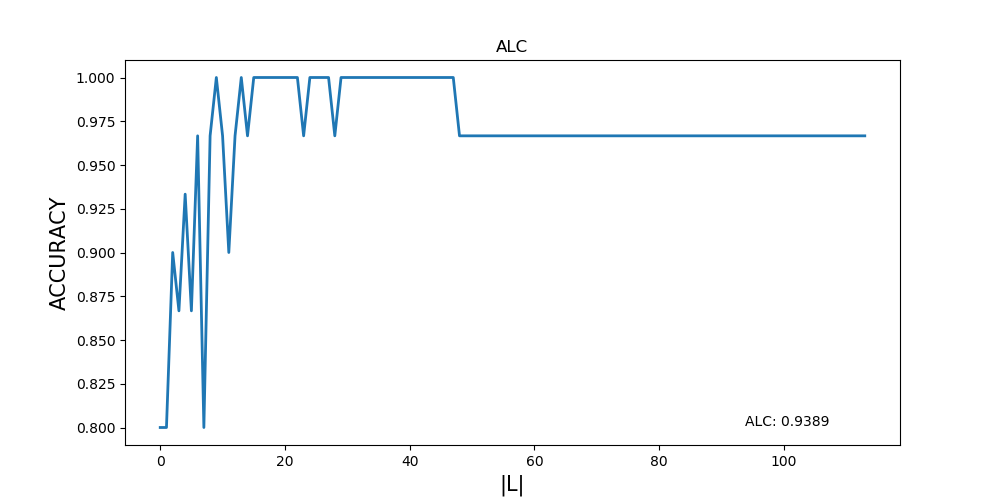

PALL: Python Active Learning Library
====================================

.. toctree::
   :maxdepth: 1
   :caption: API:

   source/activelearning
   source/containers
   source/querystrategies
   source/utils
   source/pall.datasets

Prerequisites
-------------
* `Python 3 <www.python.org/downloads>`_
* `NumPy <www.numpy.org>`_
* `SciPy <www.scipy.org>`_
* `scikit-learn <www.scikit-learn.org>`_

------------
Installation
------------
Clone or download this repository and run::

        python setup.py install

--------------------
A motivating example
--------------------

Active learning can often discover a subset of the full data set that generalizes well
to the test set. For example, we consider the Iris data set:

>>> import numpy as np

>>> from pall import ActiveLearningModel
>>> from pall.querystrategies import Margin
>>> from pall.utils import plot_learning_curve

>>> from sklearn.datasets import load_iris
>>> from sklearn.model_selection import train_test_split
>>> from sklearn.linear_model import LogisticRegression as LR
>>> from sklearn.base import clone

>>> np.random.seed(0)
>>> iris = load_iris()
>>> X, y = iris.data, iris.target
>>> train_X, test_X, train_y, test_y = train_test_split(X, y,
...                                                     test_size=0.2)
>>> lr = LR(solver="liblinear", multi_class="auto")
>>> lr = lr.fit(train_X, train_y)
>>> print(lr.score(test_X, test_y))
0.967

Using the full data set, logistic regression acheives an accuracy of 0.967 on the test data.

        >>> alm = ActiveLearningModel(clone(lr), Margin(),
        ...                           eval_metric="accuracy",
        ...                           U_proportion=0.95, random_state=0)
        >>> accuracies, choices = alm.run(train_X, test_X, train_y, test_y)
        >>> plot_learning_curve(accuracies, 0, len(accuracies),
        ...                     eval_metric="accuracy")

From the learning curve we see that only the first 25 or so data points
are required to acheive perfect 1.0 accuracy on the test data.

>>> lr_small = clone(lr)
>>> lr_small = lr_small.fit(alm.L.X[:25, ], alm.L.y[:25])
>>> print(lr_small.score(test_X, test_y))
1.0

--------------------------
Supported query strategies
--------------------------

* Random Sampling (passive learning)
* Uncertainty Sampling

  * Entropy Sampling
  * Least Confidence
  * Least Confidence with Bias
  * Least Confidence with Dynamic Bias
  * Margin Sampling
  * Simple Margin Sampling

* Representative Sampling

  * Density Sampling
  * Distance to Center
  * MinMax Sampling

* Combined Sampling

  * Beta-weighted Combined Sampling
  * Lambda-weighted Combined Sampling

-------------
Running Tests
-------------

From the project home directory run

        python -m unittest discover

Authors
-------
* Jake Vasilakes - jvasilakes@gmail.com

License
-------
This project is licensed under the MIT License. See [LICENSE](LICENSE) for details.

Acknowledgements
----------------
This project grew out of a study of active learning methods for biomedical text classification. The paper associated with this study can be found at [https://doi.org/10.1093/jamiaopen/ooy021](https://doi.org/10.1093/jamiaopen/ooy021).
